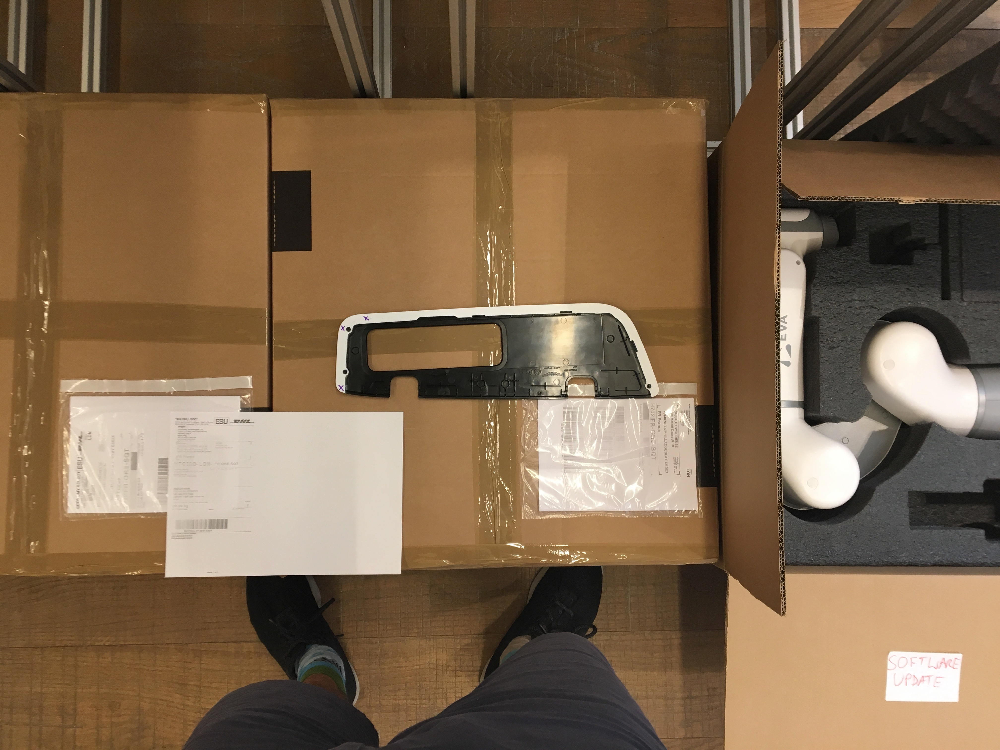
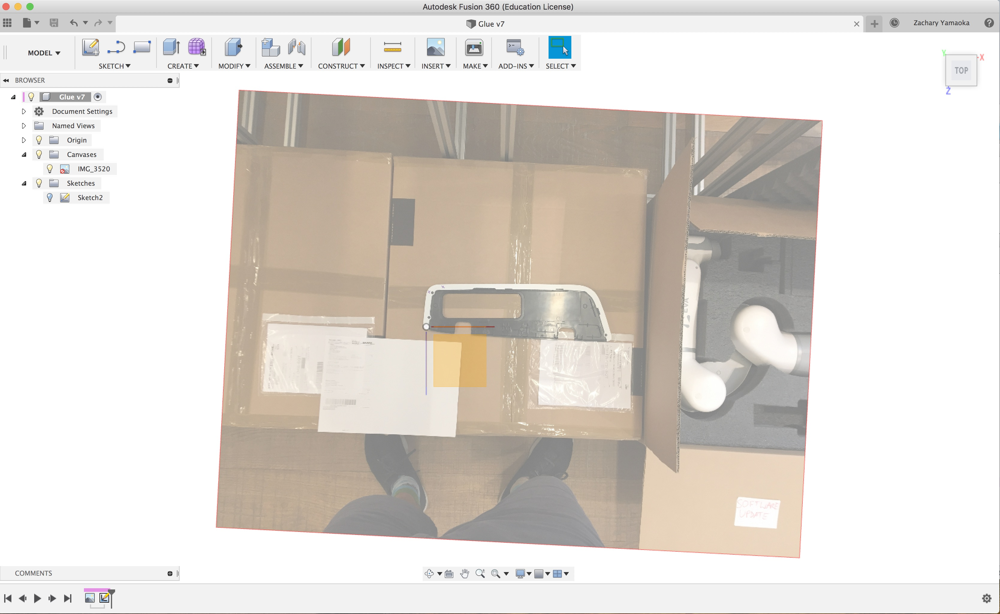
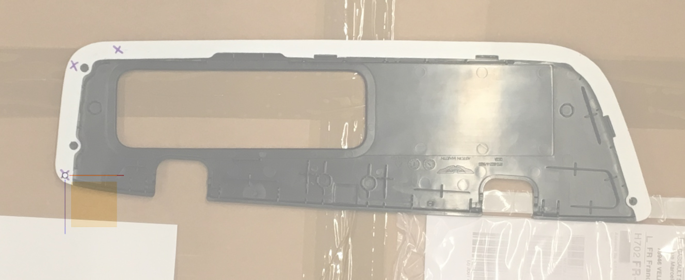
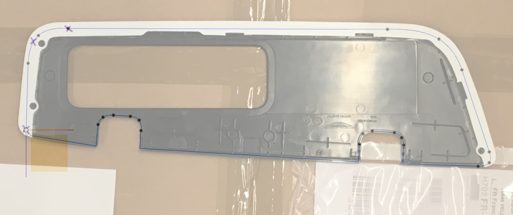
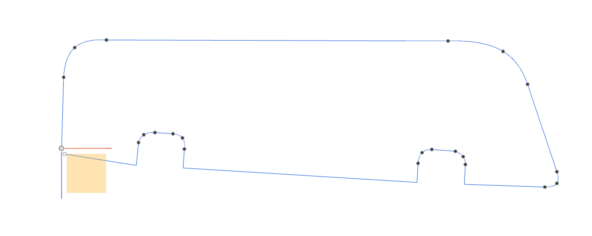
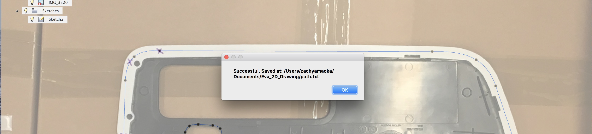
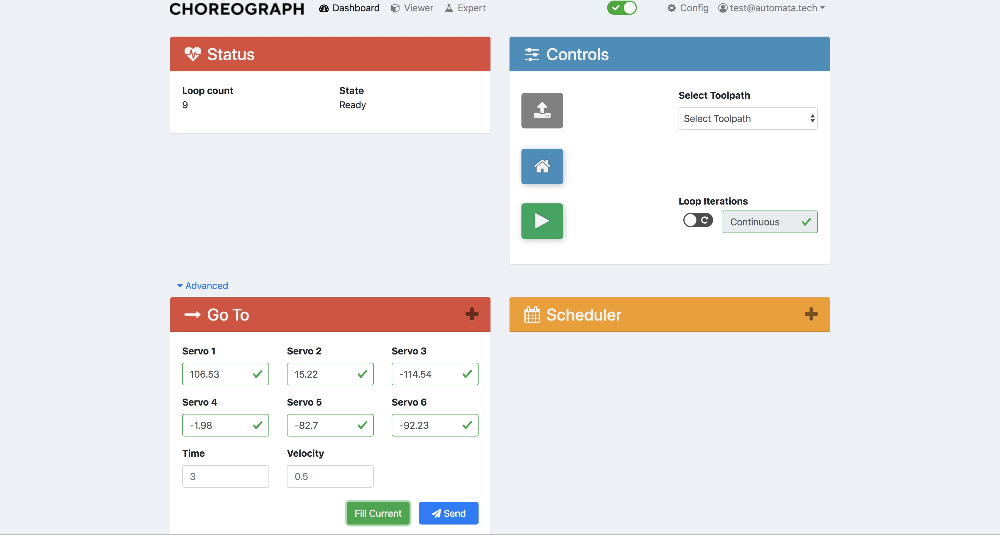

Quick Start
===========================

Short guide on how to program EVA via drawing to follow 2D tool path. Example use case:

.. raw:: html

    

        <iframe src="https://www.youtube.com/embed/RIyTcgUuLos" frameborder="0" allowfullscreen style="position: absolute; top: 0; left: 0; width: 100%; height: 100%;"></iframe>
    

Prerequisites
-----------------------------------
`Drawing Code`_

Download as zip from GitHub. Put in desired location (Desktop, Documents, ect)

`Fusion 360`_

Free download on Autodesk site. Sign up for a new account then follow the instructions.

`Eva Python SDK`_

**Important**, ``cd`` into the `Drawing Code`_ directory. Now to install, execute the following from your computer's terminal (mac + linux)::

   pipenv install git+https://github.com/automata-tech/eva_python_sdk.git@master#egg=automata

.. _Drawing Code: https://github.com/zacharyyamaoka/Eva_2D_Drawing
.. _Fusion 360: https://www.autodesk.com/campaigns/fusion-360-for-hobbyists
.. _Eva Python SDK: https://github.com/automata-tech/eva_python_sdk

Getting Started
---------------------

1. Take a photo of the desired tool-path. Typically, the further away you are the
less perspective distortion there will be. At the same time, make sure the important
features of the path are captured with sufficient resolution.

2. Open Fusion 360, Start a new design, import the photo onto the top plane (ensure photo was in landscape otherwise
fusion will distort it). Ensure that the axis are pointing in same direction as
in the photo. With the current axis orientation,
forward, left and right in Fusion corresponds the same directions relative to EVA in real life.

3. Calibrate photo size in fusion and then center the intended starting point on the image
at the fusion 360 origin (location where 3 axis intersect).

4. All tool paths must start at the origin, and **cannot loop back**. The path must be
constructed using only straight *lines* and only 3 point *fit point spline's*. Ensure there is
at most one sketch in the file at any point.

The lines will be converted to *linear* movement and the splines to *pass-through* points
in choreograph.

5.  Next you will have to run the code to export the drawing information.
Navigate to the add in button, click on *Scripts and Add-Ins*.

.. figure::  imgs/bar.jpg
    :align:   center

6. Then click the green plus next to *My Scripts*. Navigate to where you downloaded
the `Drawing Code`_, select the *Fusion 360* folder, and click open.

.. figure::  imgs/menu2.jpg
   :align:   center

7. Select the script *EvaDrawPath* and click edit. After a brief loading screen,
the spider editor should open

.. figure::  imgs/spider.jpg
    :align:   center

Edit the line::

  file_directory = "/Users/zachyamaoka/Documents/Eva_2D_Drawing"

So that it points to the location of the ``Eva_2D_Drawing`` directory on your computer

8. Back in Fusion 360, select the *EvaDrawPath* script and press run!

9. Connect to EVA over choreograph

11. Move the end effector to the desired starting position and orientation. When the code is run,
it will keep this same recorded position but self correct the head orientation to point straight down.

12. From Choreograph navigate to *Dashboard*, then *Go To*, ensure **lock is activated**,
click *Fill Current*. Record the joint angles

13. Click on your user profile in the top right, then *profile*. Record the API key

.. figure::  imgs/api.jpg
    :align:   center

14. Using your favourite text editor, open the file ``calc_tool_path.py``. Edit code to enter in
the correct API key, the measured joint angles, and ip adress you used to connect::

  host_ip = "http://172.16.16.2" # Ip you used to connect to choreograph
  token = "cec3d52b-ad0c-4caf-8624-95f09381fce9" # API Tokens
  start_joints_deg = [8.58,-21.02,-131.61,5.03,-27.68,-91.19] # Read from Go-to on choreograph

The code will use the joint positions to locate the Fusion 360 origin, and your
drawing in real space.

15. Make sure the **lock is off** in choreograph. From terminal activate the virtual pipenv::

      pipenv shell

    If your getting errors, like ``ModuleNotFoundError: No module named 'automata'``,
    it is because the environment has not been activated. Once activated, ``cd`` into Eva_2D_Drawing Directory,
    Place the e-stop next to you, then again from within the directory::

      python calc_tool_path.py

16. It is unlikely that the robot will execute the path perfectly to begin with.

* If not going far enough, recalibrate image size in Fusion 360 and adjust drawing
* If going far enough but at wrong angle, adjust orientation of image in Fusion
  360 and then adjust drawing.
* **Remember to run Fusion 360 script again** to export the new path data.

17. contact @ zach.yamaoka@gmail.com if you have questions!
